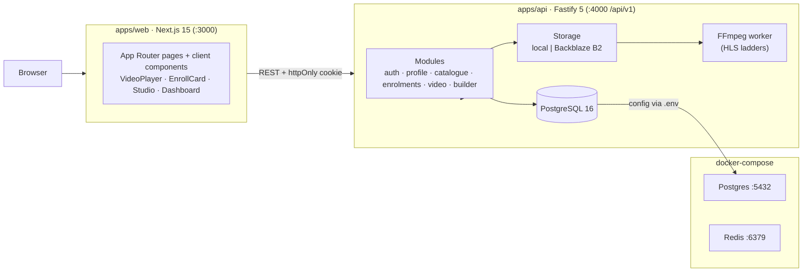

# Takwimu Data School — LMS Platform

> Practical AI & data education for Africa: AWS certifications, AI engineering, and data careers.
> Master specification: [`../lms-platform-specs.md`](../lms-platform-specs.md).

A full-stack TypeScript monorepo: **Fastify 5** API, **Next.js 15** web client, shared typed contract layer, Postgres 16 schema + migrations, seeded curriculum, and a self-hosted video pipeline (chunked upload → FFmpeg HLS transcode → enrolment-gated streaming).

- **Sprints 1–4 delivered** — Auth & onboarding · Catalogue & search · Enrolment, progress & video lessons · Course builder & video pipeline. See [`docs/architecture.md`](docs/architecture.md) for scope and [`docs/development.md`](docs/development.md) for the roadmap.



---

## Quick start

Prerequisites: **Node.js ≥ 22** · **Docker**

```bash
cd lms-platform
npm install
cp apps/api/.env.example apps/api/.env          # see docs/configuration.md
cp apps/web/.env.example  apps/web/.env.local
npm run db:up            # Postgres 16 + Redis 7
npm run db:migrate       # apply SQL migrations
npm run db:seed          # 3 course tracks + demo account
npm run dev              # API :4000 · Web :3000
```

| Check | Command / URL |
| --- | --- |
| API health | `curl http://localhost:4000/api/v1/health` |
| Web UI | http://localhost:3000 |
| Demo login | `demo@takwimu.school` / `Takwimu123` |

Stop with `Ctrl+C` then `npm run db:down`.

---

## Documentation

| Doc | Contents |
| --- | --- |
| [`docs/architecture.md`](docs/architecture.md) | System/runtime diagrams, auth session flow, video pipeline, data model (ER), enrolment lifecycle, sprint roadmap |
| [`docs/configuration.md`](docs/configuration.md) | Environment variables for API and web, storage modes, B2/SSO/SMTP setup |
| [`docs/api-reference.md`](docs/api-reference.md) | Endpoint catalogue by module with authentication notes |
| [`docs/development.md`](docs/development.md) | Project layout, validation/testing, demo data, troubleshooting |

**Sensitive configuration values must never be committed — only `.env.example` templates are tracked** (see `.gitignore`).

---

## License & attribution

Takwimu Data School content is school-owned; reuse with attribution. Raleway (OFL), ffmpeg-static, hls.js — see each project's license. AWS and all third-party names belong to their respective owners.