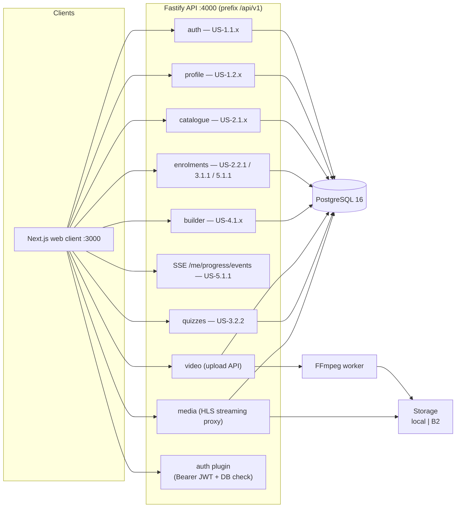
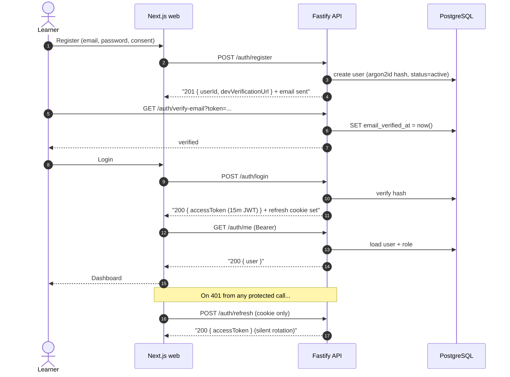
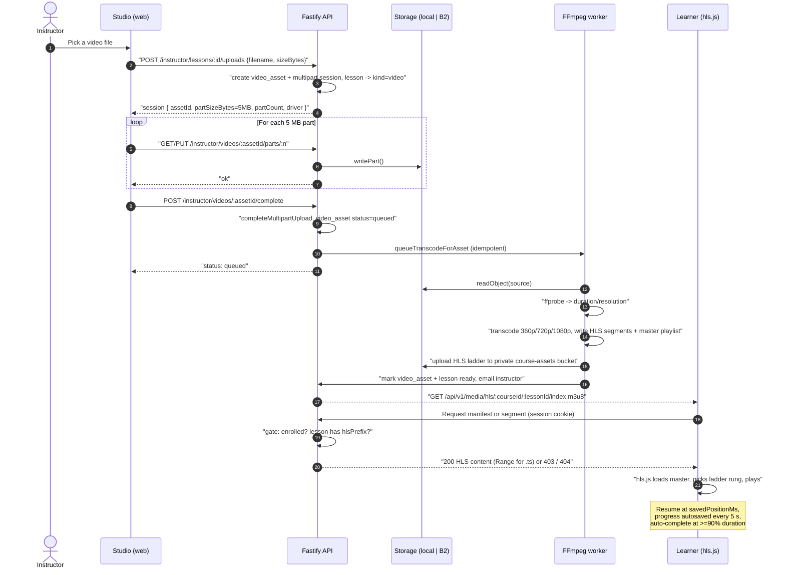
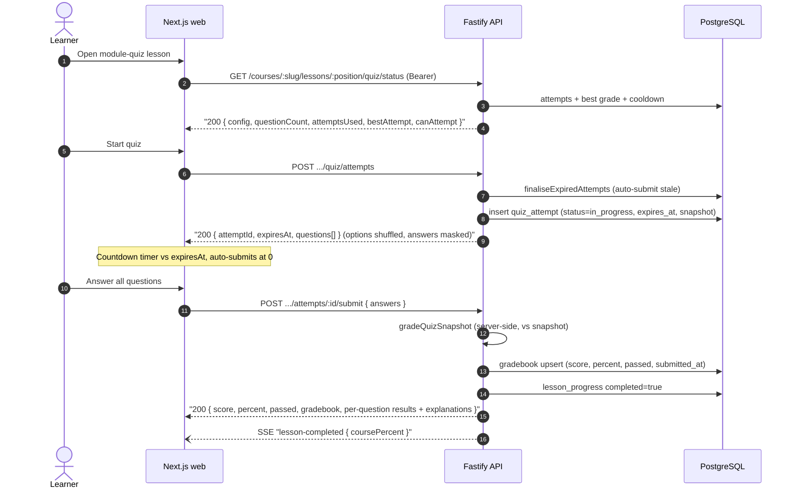
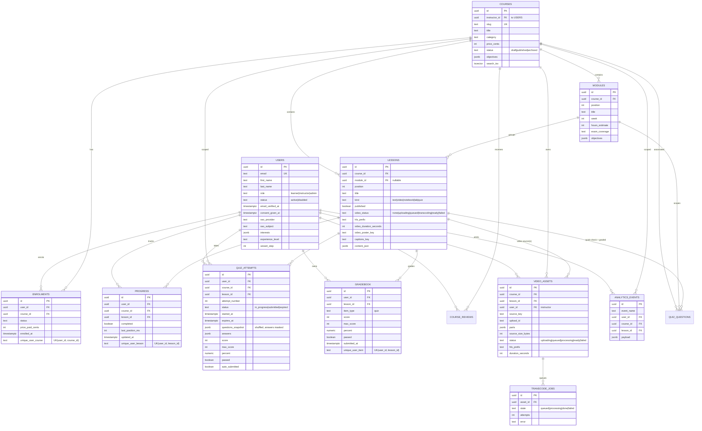
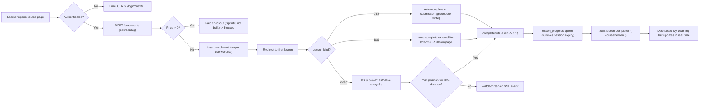
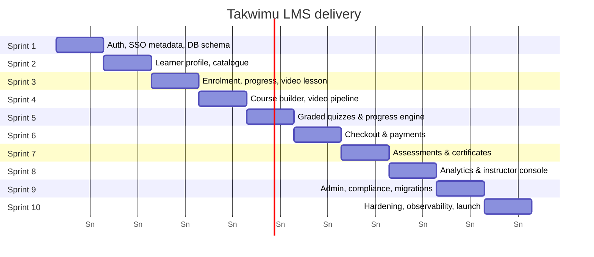

# Architecture

Scope delivered through **Sprint 5** of the master specification, with diagrams for key flows.

## Delivered scope

| Sprint | Features | User stories |
| --- | --- | --- |
| **1 — Foundation & Auth** | Email/password + argon2id, email verification, JWT access + httpOnly refresh rotation, RBAC (`learner`/`instructor`/`admin`), Google/Microsoft SSO scaffolding, rate limiting, Helmet CSP | US-1.1.1, US-1.1.2 |
| **2 — Profiles & Catalogue** | 3-step onboarding wizard, bio, avatar (sharp), ranked tsvector + pg_trgm search, facets, sort, pagination; seeded 3-course catalogue + 12-module AWS AI track | US-1.2.x, US-2.1.x |
| **3 — Enrolment & Video** | Free enrolment, enrolment context, playback-position persistence, HLS lesson player (hls.js), enrolment-gated streaming proxy with Range | US-2.2.1, US-3.1.1 |
| **4 — Builder & Pipeline** | Instructor Studio (course/module/lesson CRUD + publish, ownership-scoped), chunked 5 MB upload (local/B2), FFmpeg HLS worker (360p/720p/1080p), captions & posters | US-4.1.1, US-4.1.2, US-4.1.3 |
| **5 — Quizzes & Progress** | Graded end-of-module quizzes (server-side grading, snapshot attempts, time limit + auto-submit, max attempts + cooldown, shuffle, gradebook), progress engine (text auto-complete on scroll/timer, video ≥90% watched, quiz auto-complete on submission, SSE real-time progress stream) | US-3.2.2, US-5.1.1 |

## Runtime map



## Authentication & session lifecycle



## Video pipeline (upload → HLS → watch)



## Graded quiz flow (US-3.2.2)



## Data model


## Enrolment & progress lifecycle



## Delivery roadmap (master spec)



**Done:** Sprints 1–5 · **Next:** Sprint 6 (paid checkout — currently blocks paid enrolment on priced courses), 7–10.
```